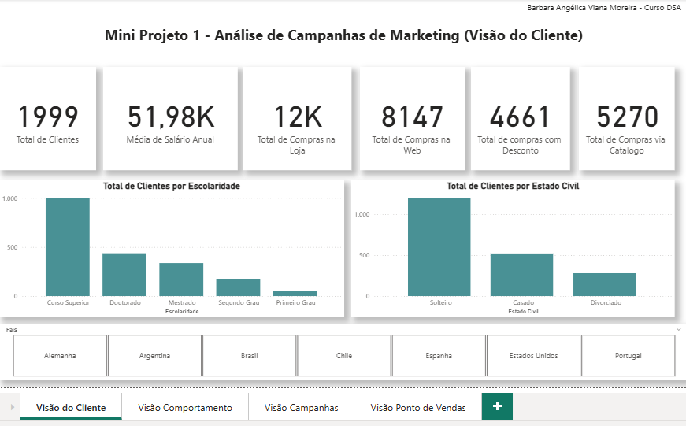
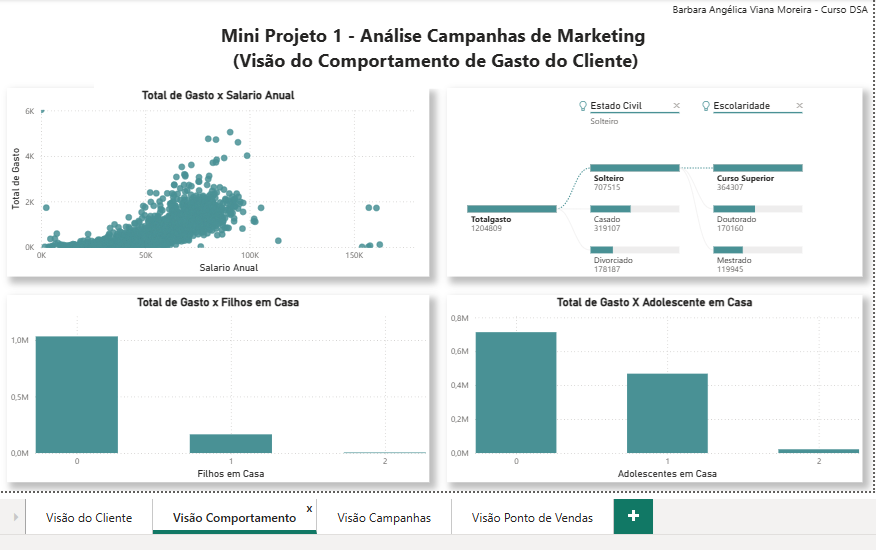
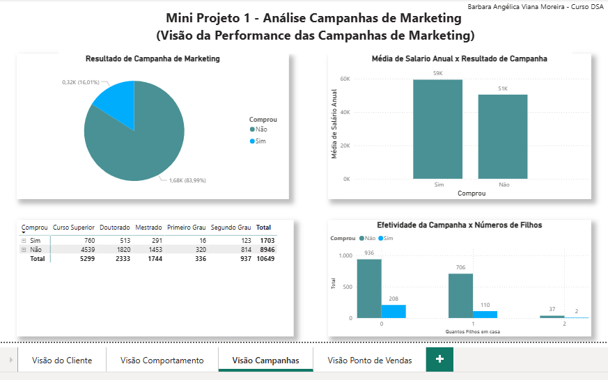
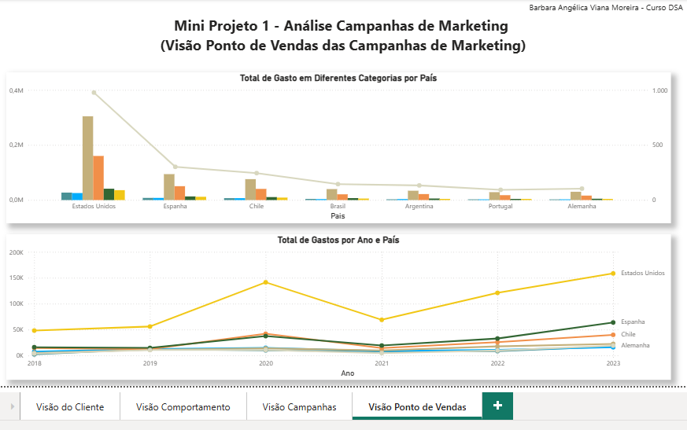

# 📈 Mini Projeto 1 – Análise de Campanhas de Marketing
*Projeto realizado como parte do curso da Data Science Academy.*

Análise desenvolvida no Power BI com foco nas campanhas de marketing em diferentes países, considerando perfis de clientes, comportamento de compra e evolução dos gastos.

## 📸 Visão Geral do Dashboard

### Visão do Cliente

**KPIs principais:**
-Total de Clientes: 1.999
-Média de Salário Anual: 51,98K
-Total de Compras na Loja: 12K
-Total de Compras na Web: 8.147
-Total de Compras com Desconto: 4.661
-Total de Compras via Catálogo: 5.270

-**Clustered column chart (gráfico de colunas clusterizado):** utilizado para observamos o **Total de Clientes por Escolaridade** e **Total de Clientes por Estado Civil**  
-**Slicer (segmentação de dados)**: utilizado para segmentar os dados por país

-**Análise:** a maioria dos clientes são solteiros e com ensino superior. A loja física é sem dúvida o maior volume de compras.

### 2. Visão Comportamento

-**Scatter chart (gráfico de dispersão):** para analisarmos **Total de Gasto x Salário Anual**  
-**Decomposition Tree (árvore hierárquica):** para analisarmos o **Total Gasto em relação à Escolaridade e Estado Civil**  
-**Clustered column chart (gráfico de colunas clusterizado):** para analisarmos **Total de Gasto x Filhos em casa**  
-**Clustered column chart (gráfico de colunas clusterizado):** para analisarmos **Total de Gasto x Adolescente em Casa**  

-**Análise:** Existe uma tendência positiva entre salário e gasto total, mas o gráfico mostra uma alta dispersão, sugerindo que salários mais altos nem sempre se traduzem em maiores gastos. Isso pode indicar a influência de outros fatores, como perfil familiar ou estilo de vida. A ligação entre Curso Superior e Estado Civil “Solteiro”' representa um dos maiores volumes de gasto. Este insight ajuda a definir o perfil dominante dos clientes com maior potencial de consumo, útil para segmentações e campanhas mais direcionadas. O gasto tende a diminuir conforme o número de filhos em casa aumenta. Isso pode indicar uma redução do orçamento disponível para consumo individual, ou uma mudança de prioridades financeiras em famílias maiores. Um padrão semelhante é observado: quanto mais adolescentes no lar, menor o total de gasto médio. 

### 3. Visão Campanhas

-**Pie Chart (gráfico de pizza):** para analisarmos e relevância da quantidade de quem Comprou e Não comprou  
-**Clustered column chart (gráfico de colunas clusterizado):** para analisarmos a diferença entre **Média de Salário Anual x Resultado de Campanha**  
-**Matrix (matriz):** utilizamos o comparativo Comprou/ Não comprou, os níveis de escolaridade e o total de números de compras na web.  
-**Clustered column chart (gráfico de colunas clusterizado):** para analisarmos a **Efetivadade da CCampanha x Números de filhos**  

-**Análise:** Mostra que 16,01% dos clientes realizaram a compra após a campanha. A grande maioria (83,99%) não converteu, indicando espaço para melhoria na abordagem ou no público-alvo. Clientes que compraram possuem, em média, um salário anual de 59K, contra 51K dos que não compraram. Sugere que campanhas são mais eficazes em pessoas com maior poder aquisitivo, ou seja, a campanha converte melhor entre pessoas com maior renda e maior escolaridade e famílias menores (sem filhos ou com apenas um) respondem melhor à campanha.

### 4. Visão Ponto de Vendas

-**Line and clustered column chart (gráfico de colunas agrupadas e linha):** para analisarmos o **Total de Gasto em Diferentes Categorias por País**  
-**Line chart (gráfico de linhas):** para analisarmos o **Total de Gastos por Ano e País**  

-**Análise:** Os Estados Unidos são de longe o país com maior volume de gastos, destacando-se principalmente em eletrônicos e móveis, Espanha e Chile aparecem logo atrás, mas com valores bem mais baixos. Os Estados Unidos lideram consistentemente o total gasto de 2018 a 2023, no ano de 2020 teve um pico significativo, possivelmente indicando uma intensificação das campanhas

## ✅ Conclusão

A análise permite identificar onde e como alocar melhor os investimentos em marketing, otimizando resultados com base em dados demográficos e comportamentais dos clientes.

---

📌 *Projeto realizado como parte do curso da Data Science Academy.*
